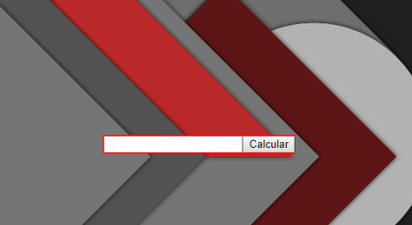
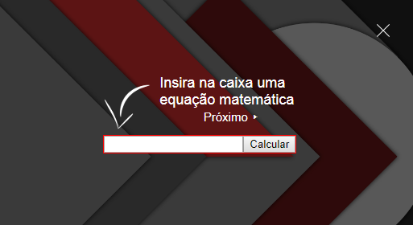
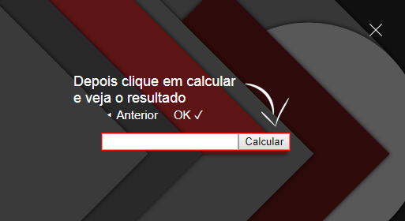

# SweetHelp

Bibioteca em JavaScript que facilita a exibição de tutoriais e tópicos de ajuda, construída com inspiração na biblioteca Sweet Alert. Através dela você pode destacar um elemento da página e exibir uma mensagem de ajuda em torno dele.

## Características:
 - Fácil de usar  
 - Customizável  
 - Passos de ajuda altamente dinâmicos  
 - Posicionamento de texto, setas e links em torno do elemento totalmente automatizado  
 - Centraliza elementos na página (rolando as barras de rolagem) para que o mesmo fique visível ao usuário  
 - Permite que avanço no tutorial ocorra apenas após validação  

## Exemplo

> [Código fonte do exemplo](exemplo.html)

Desenvolvido por [Leonardo Costa](https://github.com/leonardoteck) e propriedade exclusiva de [Level One Solutions](http://levelonesolutions.com.br).

**Uso restrito. Todos os direitos reservados.**